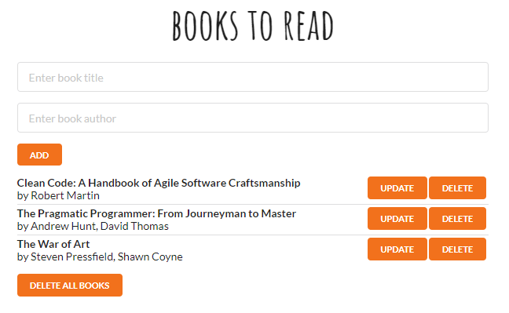

## Books to read app

I built this project in order to practice using Local Storage with React.

Using this app you can:
- see a list of books
- add a new book
- update book
- delete book
- delete all books

#### Install & Start

    $ git clone https://github.com/orvalho/books-to-read
    $ cd books-to-read
    $ npm install
    $ npm start

#### App

#### Stack

-   React
-   React DOM
-   Local Storage
-   Semantic UI